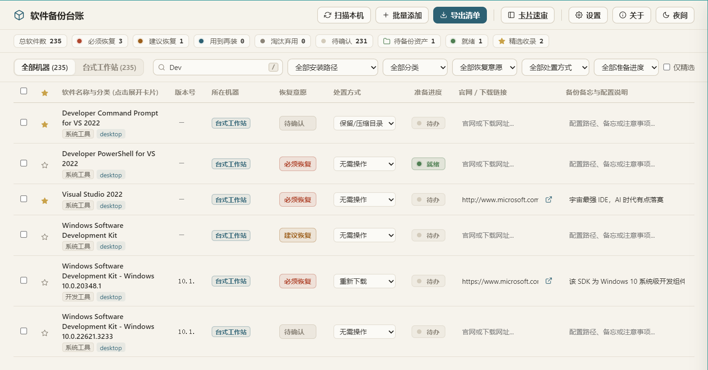

<div align="center">

# 软件备份台账

**把电脑里的软件家底清点清楚，重装迁移时有据可依。**

本地优先 · 单 exe 绿色运行 · 数据可携带

[](../../releases)
[](#安装)
[](https://v2.tauri.app/)
[](LICENSE)

</div>



---

## 核心价值

换机、重装系统时，真正麻烦的从来不是安装软件，而是 **想不起来装过什么、更不知道哪些配置散落在哪里**。

软件备份台账把这件事收敛成两条动作：**一次扫描**，把本机软件自动清点入库；**一次标注**，为每款软件决定「要不要装、怎么备份」。最终产出的不是一份冷冰冰的列表，而是一张 **可以直接照着执行的重装恢复清单**。

- **本地优先** — 数据全部保存在本地 `data/` 目录，不联网、不上传、不依赖账号。
- **绿色便携** — 一个 exe + 一个 `data/` 文件夹，拷到哪都能用，换机即迁移。
- **面向行动** — 记下每款软件的机器分布、安装路径、官网与配置备忘，重装时照着做即可。

## 功能特点

- **一键扫描本机** — 自动采集注册表安装项、便携软件与快捷方式；扫描后弹窗预览候选，勾选后再入库，已删除项不再复活。
- **软件图标** — 扫描时从 exe 抽取 32×32 图标（注册表 `DisplayIcon` / 快捷方式 / 绿色软件主程序），主表格、抽屉与卡片速审在名称前显示缩略图，一眼认出软件；取不到则回退通用图标。
- **开发环境复现** — 扫描时一并采集开发环境的声明式清单（Python / Rust / VS Code 扩展 / Git / Node / Go / .NET，含 pip/cargo/git 源与配置文件），包列表与配置原文落到 `data/evidence/<设备>/dev-env/`；独立的「开发环境」页按设备折叠展示文件清单与短恢复命令，一键复制。
- **浏览器扩展台账** — 只读采集已安装浏览器（Edge / Chrome / Brave / Firefox 等）的扩展名称、版本、来源与启用状态；扫描字段只读，另可给每条扩展加**备注**（`data/extensions.json`）与**附件归档**（`data/vault/<主机>/ext/<扩展ID>/`），独立「浏览器」页表格展示。绝不读取扩展存储数据、Cookie 或密码。
- **配置归档保管箱** — 软件卡片与浏览器页均可手动拖入 / 选择配置文件归档到 `data/vault/<主机>/`，随台账一起拷走；删除软件时级联清理。
- **恢复意愿分级** — 必须恢复 / 建议恢复 / 用到再装 / 淘汰弃用 / 待确认。
- **处置方式与配置备忘** — 保留目录、重新下载、账号同步、无需操作，并记录配置存放位置。
- **准备进度跟踪** — 标记每一项是否已备份就绪。
- **AI 辅助预判**（可选）— 接入本地 LM Studio 或任意 OpenAI 兼容端点（如 DeepSeek），自动补全分类、恢复意愿与配置建议。
- **多机器视图** — 记录每款软件出现在哪台机器、安装在哪里。
- **重复条目合并** — 将同一软件的多个条目归并为一条，自动汇总各机器路径。
- **Markdown 导出** — 一键生成《重装恢复清单》与《精选资产库》两份落地文档，**另存为时可自选保存路径**。
- **亮 / 暗主题**。

## 安装

1. 前往 [Releases](../../releases) 下载最新的 `windows-software-ledger-v<版本>-windows-x64.zip`（内含 exe 与 LICENSE），解压得到 `windows-software-ledger.exe`。
2. 放进任意文件夹，双击运行。
3. 首次运行会在 exe 同级自动创建 `data/` 目录，所有清单与设置都保存在这里。

> **系统要求**：Windows 10 / 11。精简版系统若缺少 WebView2 Runtime，请先安装 [Microsoft Edge WebView2](https://developer.microsoft.com/microsoft-edge/webview2/)。

### 便携与迁移

```
软件备份台账/
├─ windows-software-ledger.exe
└─ data/                 ← 清单与设置，连同文件夹一起拷走即可
```

## 使用

1. **扫描本机** — 点击顶部「扫描本机」，自动收集本机软件；首次运行直接导入，之后会在弹窗中列出新增候选，勾选后再入库。
2. **整理与标注** — 在列表或卡片速审中，为每款软件设置恢复意愿、处置方式与配置备忘。
3. **（可选）AI 预判** — 在「设置」中配置 LLM 端点，一键补全分类与建议。
4. **导出清单** — 点击「导出清单」，生成重装恢复清单与精选资产库。

## 开发

编译方式见 [BUILD.md](BUILD.md)。

## 贡献

欢迎提交 Issue 与 Pull Request。

1. 从 `master` 切出功能分支；
2. 提交信息保持清晰，推荐 [Conventional Commits](https://www.conventionalcommits.org/)；
3. 提交 PR 前确保 `scripts\cargo-msvc.bat test` 通过。

## License

本项目基于 [GNU Affero General Public License v3.0](LICENSE) 授权。
