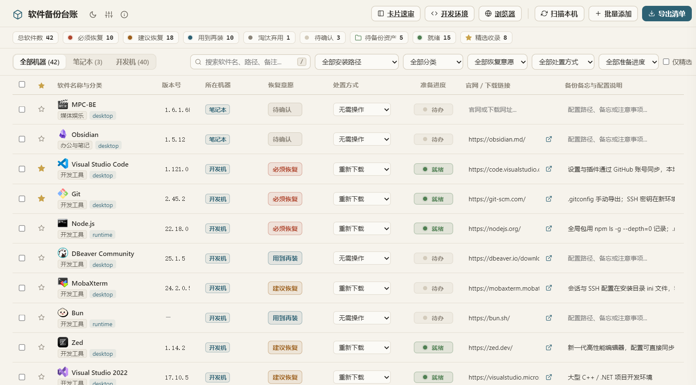

<div align="center">

# 软件备份台账

**把电脑里的软件家底，列成一张能照着重装的清单。**

[](../../releases)
[](#安装)
[](https://v2.tauri.app/)
[](LICENSE)

</div>



---

## 不是再列一张 Excel，而是把重装这件事想清楚

换机、重装系统时，真正麻烦的从来不是安装软件，而是 **想不起来装过什么、更不知道哪些配置散落在哪里**。

软件备份台账把这件事收敛成两条动作：**一次扫描**，把本机软件自动清点入库；**一次标注**，为每款软件决定「要不要装、怎么备份」。最终产出的不是一份冷冰冰的列表，而是一张 **可以直接照着执行的重装恢复清单**。

- **本地优先** — 数据全部保存在本地 `data/` 目录，不联网、不上传、不依赖账号。
- **绿色便携** — 一个 exe + 一个 `data/` 文件夹，拷到哪都能用，换机即迁移。
- **面向行动** — 记下每款软件的机器分布、安装路径、官网与配置备忘，重装时照着做即可。

## 功能特点

- **一键扫描本机** — 自动收集注册表安装项、便携软件与开始菜单快捷方式；扫完先弹窗列出候选，勾选再入库，已删除项不再复活。名称前显示软件自己的图标，一眼认出。
- **开发环境复现** — 扫描时顺带采集 Python、Rust、VS Code 扩展、Git、Node、Go、.NET 的全局包与配置，按设备列成一张清单，换电脑时照着命令敲一遍就装回来。只跑只读命令，不读环境变量、SSH 私钥和 git 凭据。
- **浏览器扩展台账** — 只读列出已装浏览器（Edge / Chrome / Brave / Firefox 等）里每个扩展的名称、版本、来源和启用状态，单独一页展示，还能给每条加备注、归档附件。绝不读 Cookie、密码或扩展自己存的数据。
- **配置归档保管箱** — 软件抽屉和浏览器页都能手动拖入配置文件归档，随台账一起拷走；删掉软件时归档也一并清掉。
- **恢复意愿、处置方式与准备进度** — 必须恢复 / 建议恢复 / 用到再装 / 淘汰弃用 / 待确认；处置方式可选保留目录、重新下载、账号同步、无需操作，并记下配置放在哪。标完就能看到准备进度，重装前一眼看清还差哪些。
- **卡片速审** — 一次只问一条：左边是待办列表和进度，右边给一款软件定意愿与处置。键盘 `1–5` 定恢复意愿，翻页键切下一条，两百条也能一口气标完。
- **AI 辅助预判**（可选）— 接入本地 LM Studio 或任意 OpenAI 兼容端点（如 DeepSeek），自动补全分类、恢复意愿与配置建议。
- **多机器视图与合并** — 记下每款软件装在哪台机器、具体路径；同一软件的多条记录一键合并，自动汇总各机器路径。
- **Markdown 导出** — 一键生成《重装恢复清单》与《精选资产库》两份落地文档，照着做就行。
- **亮 / 暗主题** — 顶部一键切换日间 / 夜间。

## 安装

1. [直接下载 zip](https://github.com/iroha3/windows-software-ledger/releases/latest/download/windows-software-ledger-windows-x64.zip)（内含 exe 与 LICENSE），解压得到 `windows-software-ledger.exe`。
2. 放进任意文件夹，双击运行。
3. 首次运行会在 exe 同级自动创建 `data/` 目录，所有清单与设置都保存在这里。

### 便携与迁移

```
软件备份台账/
├─ windows-software-ledger.exe
└─ data/                 ← 清单与设置，连同文件夹一起拷走即可
```

## 使用

1. **扫描本机** — 点击顶部「扫描本机」，自动收集本机软件；首次运行直接导入，之后会在弹窗中列出新增候选，勾选后再入库。
2. **整理与标注** — 在列表或卡片速审中，为每款软件设置恢复意愿、处置方式与配置备忘。
3. **（可选）AI 预判** — 在「设置」中配置 LLM 端点，一键补全分类与建议。
4. **导出清单** — 点击「导出清单」，生成重装恢复清单与精选资产库。

## 开发

编译方式见 [BUILD.md](BUILD.md)。

## 贡献

欢迎提交 Issue 与 Pull Request。

1. 从 `master` 切出功能分支；
2. 提交信息保持清晰，推荐 [Conventional Commits](https://www.conventionalcommits.org/)；
3. 提交 PR 前确保 `scripts\cargo-msvc.bat test` 通过。

## License

本项目基于 [GNU Affero General Public License v3.0](LICENSE) 授权。
